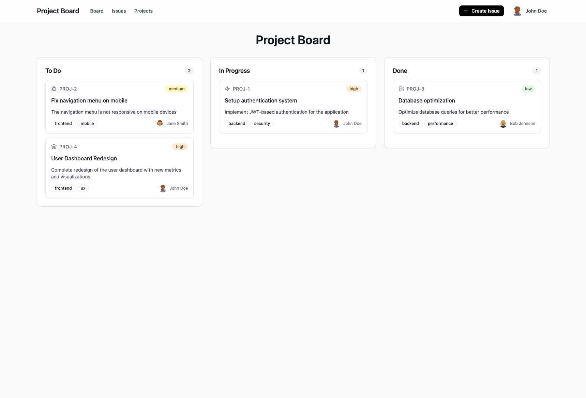

# Jira App

Project management with drag-and-drop kanban boards.



## Features

- Kanban board with drag and drop
- Issue tracking and management
- User authentication
- Project organization

## Tech Stack

- Next.js 15.5
- React 19
- TypeScript
- Tailwind CSS

## Getting Started

```bash
npm install
npm run dev
```

Open [http://localhost:3000](http://localhost:3000)

## Docker

```bash
docker-compose up -d
```

Open [http://localhost:3000](http://localhost:3000)

## API Endpoints

### Issues
- `GET /api/issues` - Get all issues
- `POST /api/issues` - Create new issue
- `GET /api/issues/[id]` - Get issue by ID
- `PUT /api/issues/[id]` - Update issue
- `DELETE /api/issues/[id]` - Delete issue

### Comments
- `GET /api/issues/[id]/comments` - Get issue comments
- `POST /api/issues/[id]/comments` - Add comment to issue

### Projects
- `GET /api/projects` - Get all projects
- `POST /api/projects` - Create new project
- `DELETE /api/projects/[id]` - Delete project

### Users
- `GET /api/users` - Get all users
- `POST /api/auth/signup` - User registration
- `POST /api/auth/signin` - User login

### Health
- `GET /api/health` - Health check

## Project Structure

```
├── app/                 # Next.js App Router
├── components/          # React components
├── contexts/            # React Context providers
├── lib/                 # Database and utilities
└── README.md
```